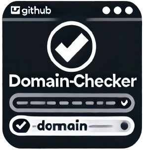

<!-- PROJECT LOGO -->
<br />
<div align="center">
  <a href="https://github.com/TysonThurman/domain-checker">
    
  </a>

<h3 align="center">Domain Checker</h3>

  <p align="center">
    A library for pulling information about domain names using the WHOIS API
    <br />
  </p>
</div>

<!-- Screenshots -->
## Screenshots


<!-- GETTING STARTED -->
## Getting Started

To get started using the code, see below.

### Prerequisites
* npm
  ```sh
  npm install npm@latest -g
  ```

### Installation

1. Get a free API Key at [https://whois.whoisxmlapi.com/](https://whois.whoisxmlapi.com/)
2. Clone the repo
   ```sh
   git clone https://github.com/TysonThurman/domain-checker.git
   ```
3. Install NPM packages from root directory
   ```sh
   npm install
   ```
4. Enter your API in the `.env` file
   ```js
   API_KEY='ENTER YOUR API';
   ```
5. Install ReactJS front-end packages
   ```sh
   cd client
   npm install
   ```
6. You can then run the ReactJS front-end in dev
   ```sh 
   npm run dev
   ```

<!-- ROADMAP -->
## Roadmap

- [x] Domain Details: Get information about who registered the domain (registrar) and when the domain will expire.
- [x] Reorganize folder structure
- [x] Add front end for the application
- [ ] Update the front end to use the logic of the application
- [ ] Add logging for the application (for server back-end)
- [ ] Add button/options for different functions to run (e.g. button to check availability, button to check URL, etc...)
- [ ] Configure ESLint.
- [ ] Configure Prettier
- [ ] Redesign the front end for better UI/UX
- [ ] Add testing (mocha, JEST, or similar) package/library
- [ ] Implement Light and Dark themes
- [ ] Add screenshots of the app to the README

More roadmap features to come...

See the [open issues](https://github.com/TysonThurman/domain-checker/issues) for a full list of proposed features (and known issues).


<!-- CONTRIBUTING -->
## Contributing

Contributions are what make the open source community such an amazing place to learn, inspire, and create. Any contributions you make are **greatly appreciated**.

If you have a suggestion that would make this better, please fork the repo and create a pull request. You can also simply open an issue with the tag "enhancement".
Don't forget to give the project a star! Thanks again!

1. Fork the Project
2. Create your Feature Branch (`git checkout -b feature/AmazingFeature`)
3. Commit your Changes (`git commit -m 'Add some AmazingFeature'`)
4. Push to the Branch (`git push origin feature/AmazingFeature`)
5. Open a Pull Request


<!-- LICENSE -->
## License

Distributed under the MIT License. See `LICENSE.txt` for more information.